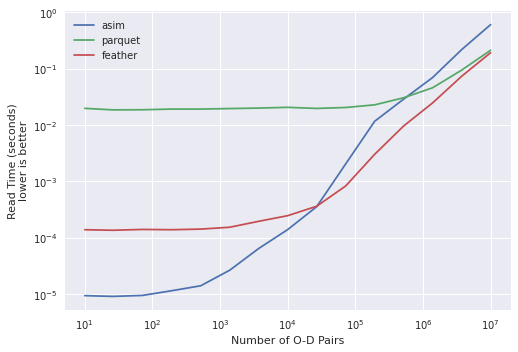

# arrowmatrix
A matrix file format

Inspired in part by
https://gist.github.com/thomwolf/13ca2b2b172b2d17ac66685aa2eeba62

This repo contains a "straw man" proposal for the next generation openmatrix format.
You can review a speed demo in the notebooks folder.


## Open Matrix (via ActivitySim)


```python
with resource_usage:
    asim_skims = skim_dict(settings) # loads all skim data into memory
```

    45.8 s: Net 7.11 GB, Total 7.45 GB


It takes some time to load, and a fair bit of RAM.  Now we can load values from one of the skim tables,
which is quick and easy, and only uses enough extra memory 
to store the values we have collected.


```python
with resource_usage:
    asim_data1 = asim_skims.get('DISTBIKE').get(otaz,dtaz)
```

    668 ms: Net 277 MB, Total 7.73 GB


## Parquet Matrix

Contrast that with the first of two formats of arrow matrix, ParquetMatrix.  
As we did above using the `skims_dict`, let's open the matrix reference itself first.


```python
with resource_usage:
    pqmx = amx.ParquetMatrix('data/mtc_full_skims.pmx')
```

    26.9 ms: Net 1e+03 KB, Total 7.73 GB


The matrix object can be created almost instantly because it
doesn't load all the data into RAM, just the schema and metadata.
The actual data remains on disk, waiting patiently for us to read
it later.  So let's do that!


```python
with resource_usage:
    pqmx_data1 = pqmx.get_rc('DISTBIKE', otaz-1, dtaz-1, attach_index=False).to_numpy().reshape(-1).astype('float32')
```

    264 ms: Net 39.8 MB, Total 7.77 GB


Loading this data from the arrow matrix requires barely more memory
footprint than the loaded data itself (the array of 10 million double-precision
floats uses 76.3 MB). 

Well, you may say, that's nothing special.  The whole point of the 
ActivitySim skims module is to be fast, by having the necessary skims
preloaded into RAM so they can be read from as fast as possible.


```python
%timeit asim_skims.get('DISTWALK').get(otaz,dtaz)
```

    566 ms ± 23.4 ms per loop (mean ± std. dev. of 7 runs, 1 loop each)


_pqmx_: "Hold my beer"


```python
%timeit pqmx.get_rc('DISTWALK', otaz-1, dtaz-1, attach_index=False).to_numpy().reshape(-1)
```

    218 ms ± 10.1 ms per loop (mean ± std. dev. of 7 runs, 1 loop each)


Of course, there's no free lunch. Arrow is super fast, but 
reading data from disk has a high fixed cost. In particular, 
for Parquet (as configured in this demo, at least) we need
to read and decompress the entire source matrix data, to 
extract what we need. We can beat the 
pre-loaded ActivitySim skims when the chunk size is very large, 
but for very small chunk sizes the RAM solution is much faster. 


```python
otaz2, dtaz2 = otaz[:50], dtaz[:50]
```


```python
%timeit asim_skims.get('DISTWALK').get(otaz2,dtaz2)
```

    9.47 µs ± 191 ns per loop (mean ± std. dev. of 7 runs, 100000 loops each)


```python
%timeit pqmx.get_rc('DISTWALK', otaz2-1, dtaz2-1, attach_index=False).to_numpy().reshape(-1)
```

    19.6 ms ± 858 µs per loop (mean ± std. dev. of 7 runs, 10 loops each)


But what if I want the speed of in-memory data, but without actually needing to allocate all that memory?

## Feather Matrix


```python
with resource_usage:
    fmx = amx.FeatherMatrix('data/mtc_full_skims_uncompressed.fmx')
```

    1.08 s: Net 620 KB, Total 7.8 GB


Feather is able to point to space on disk and use it like RAM.  It's not quite as fast as
actual RAM, but these days solid state drives can get kind of close.  So, like ParquetMatrix above, 
we create the object reference almost instantly and with no overhead.

We can contrast now the performance with loading this big chunks...


```python
%timeit fmx.get_rc('DISTBIKE', otaz-1, dtaz-1, attach_index=False).to_numpy().reshape(-1)
```

    200 ms ± 7.69 ms per loop (mean ± std. dev. of 7 runs, 1 loop each)


... and the small chunks.


```python
%timeit fmx.get_rc('DISTWALK', otaz2-1, dtaz2-1, attach_index=False).to_numpy().reshape(-1)
```

    140 µs ± 3.25 µs per loop (mean ± std. dev. of 7 runs, 10000 loops each)


Let's plot the relative speed across a variety of chunk sizes.


    
Assuming a large enough chunk size, either format performs better than
the current ActivitySim implementation.  Even with a quite small chunk size,
the feather format performs reasonably well and with no RAM footprint.


# Implementation Details

- arrowmatrix uses the Apache Arrow table format as its basis.
  Each matrix data table is stored as a column in this table.

- As data for matrix tables is stored in a single column 
  (essentially, a vector) and the matrix shape is implicit--
  data for matrix tables is stored in the table in row-major 
  order and implementation will need to account for this.

- ~~While the openmatrix standard includes both two dimensional 
  'data' and one dimensional 'lookup' arrays, arrowmatrix eschews
  this (in part due to limitations of the Arrow format), and 
  instead requires that all data elements be exactly the same
  shape.~~
  
- While the openmatrix standard includes two dimensional 
  'data' arrays, arrowmatrix allows any number of dimensions.
  It is still enforced that all data arrays stored in the same
  file are the same shape.

- One dimensional lookup values should be stored in Feather 
  format, 'zstd' compressed, as an arrow buffer in the file's
  metadata. (TODO: provide a demo of this.)  
  
- arrowmatrix can be any number of dimensions, not just 2.  The
  shape of the matrix is stored in metadata as a bytestring in the
  representation format of a Python tuple.  For example, a matrix
  file that is 25 by 25 is b'(25,25)'.  One dimensional arrays
  can be stored as lookup metadata, or can also be stored in a 
  different file with shape '(25,)'. 
  Similarly, matrix tables that used to be grouped logically simply
  by name can instead be arranged explicitly with three or more 
  dimensions, e.g. b'(25,25,3)' for 3 time periods.
  
- For debate: should lookup values be bound to the dimensions 
  explicitly?  In current openmatrix, they are not, although
  typically matrix files are square with common lookups or 
  non-square which makes the bindings obvious.  By allowing
  more dimensions, there is more risk of two dimensions having 
  the same cardinality but different meanings.
  
- Any data type you can store with Arrow, you can store in an 
  arrowmatrix.

- Both Parquet and Feather file formats are legit storage formats.
  Each has distinct advantages and disadvantages, especially with
  respect to file size and read/write speed.  Both formats can store
  the necessary metadata. 
  
- Uncompressed Feather data files, while useful in certain applications, 
  should not be used to transfer data between users or over a network.
  Beyond that, it is unclear whether compressed Feather or Parquet
  formats will be better for transportation planning applications.
  
- Chunk size: this demo uses a full-table chunk size. This may not be
  the best solution; technical demos with different chunk size (a.k.a.
  row group size in Parquet) are welcomed.
  
